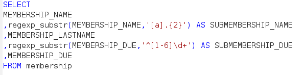
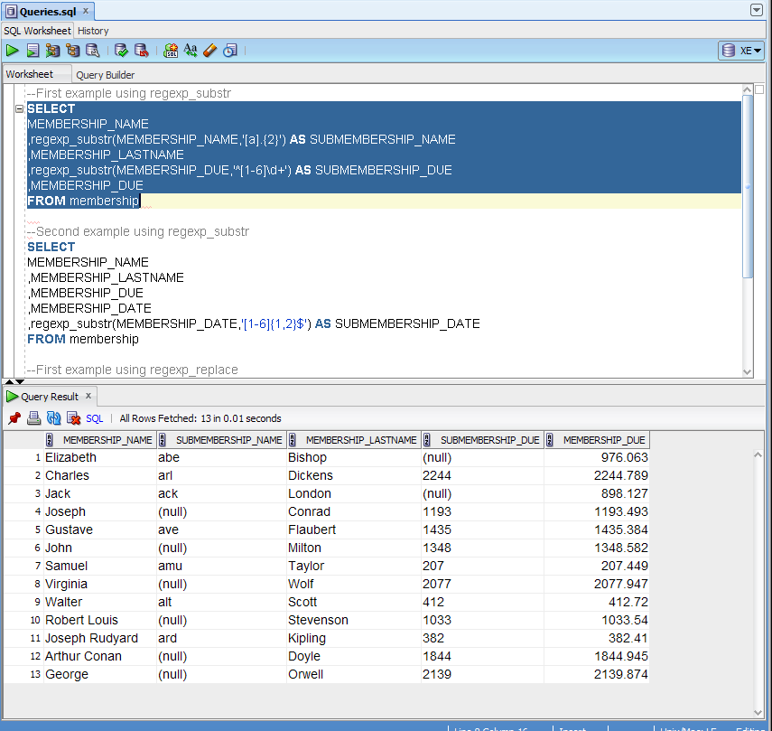
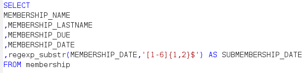
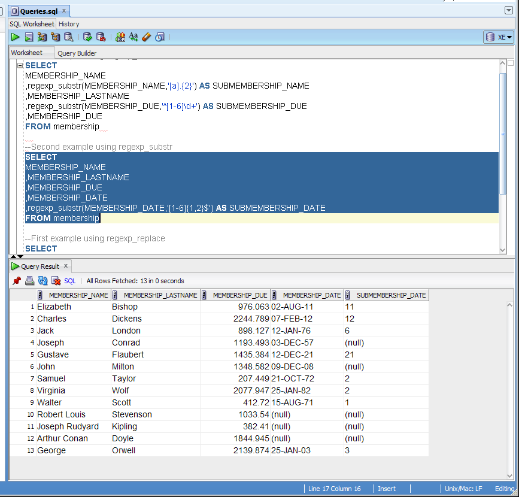
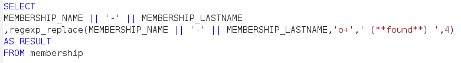
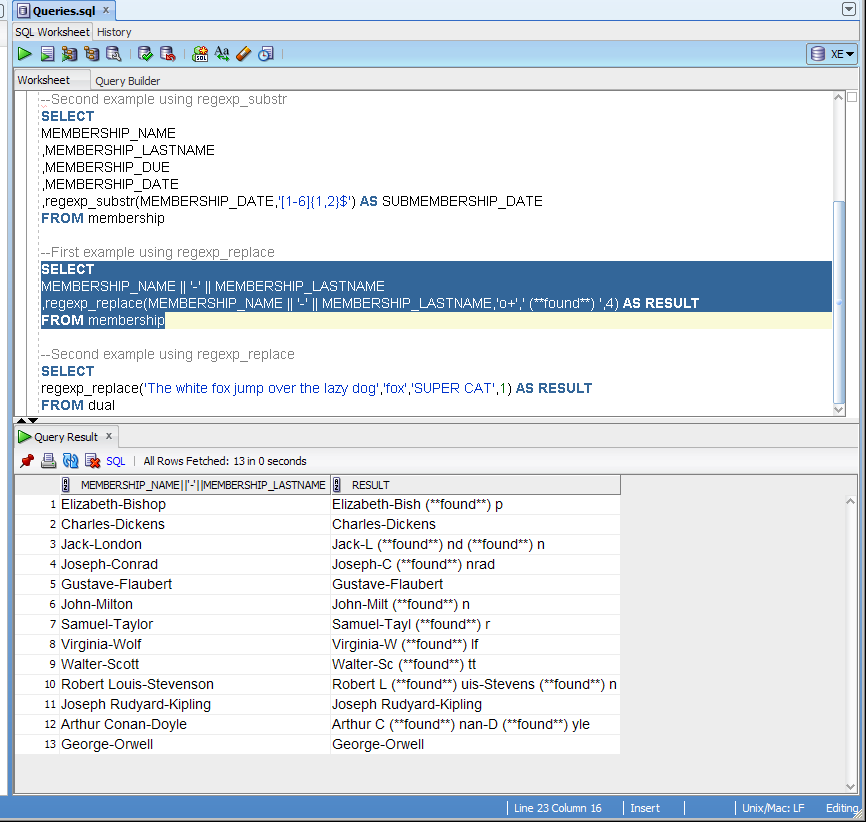
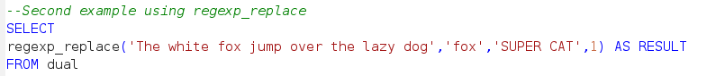
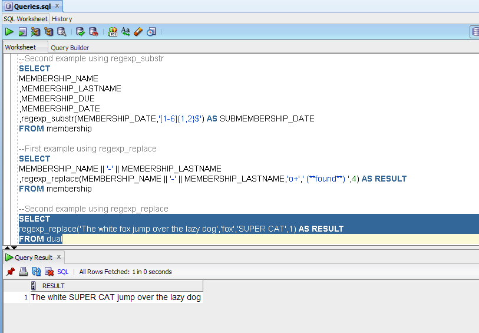

# Regular Expressions en PL/SQL Oracle, parte II

Estos ejemplos son la segunda parte de este <a href="https://github.com/lynxestudio/20130916-Oracle-RegEx">repositorio</a> anterior mostré ejemplos de búsqueda con las funciones <i>regexp_like</i> y  <i>regexp_instr</i>.

A continuación mostrare ejemplos de las funciones <b>regexp_substr</b> y <b>regexp_replace</b> respectivamente.

Como primer ejemplo de la función <b>regexp_substr</b>, obtendré dos subcadenas (substring), una de la columna MEMBERSHIP_NAME donde el carácter <i>a</i> se repita dos veces en cada registro y otra de la columna MEMBERSHIP_DUE en donde la cantidad comience con un dígito del 1 al 6 y después uno o más dígitos que se repitan.

 

 

Como segundo ejemplo de la función <b>regexp_substr</b> obtendré un substring de la columna MEMBERSHIP_DATE cuyos registros terminen con los dígitos del 1 al 6 repetidos una o dos veces.

 

 

Como primer ejemplo de la función <b>regexp_replace</b> buscaré dentro de la concatenación de las columnas MEMBERSHIP_NAME y MEMBERSHIP_LASTNAME los registros que tengan un carácter <i>o</i> repetido a partir de la posición 4  y lo sustituiré por la cadena (**found**).

 

 

Como último ejemplo ejecutamos la función <b>regexp_replace</b> en un texto y reemplazamos la palabra ‘fox’ por la palabra ‘SUPER CAT’ a partir de la posición 1.

 

